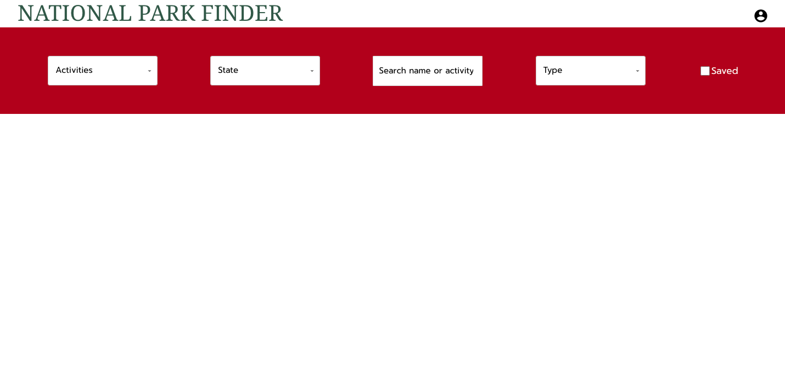
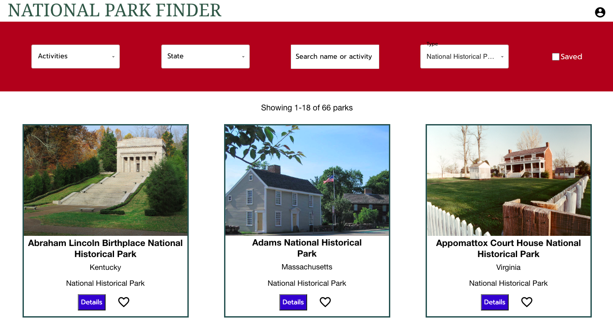
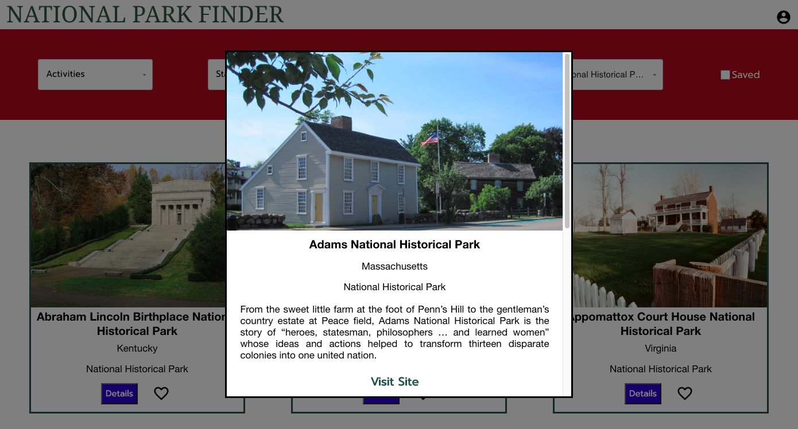
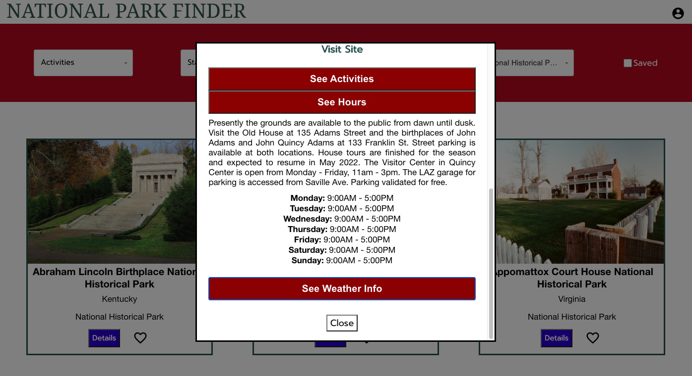
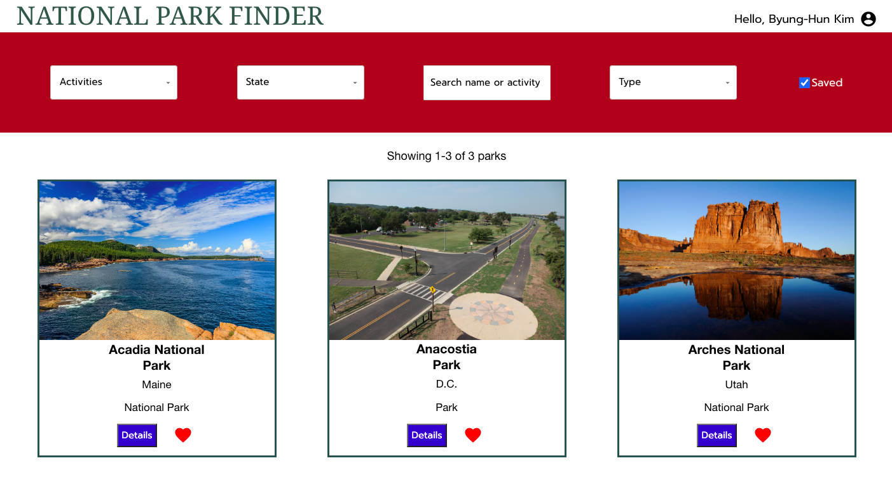

# National Park Finder

This app helps you find the 466 parks registered under the National Park Service by name, type of park, activities, and states the park is located in. 

## Live Demo

https://byunghun3.github.io/national-park-finder/

## Technologies

This project was created with:

* React.js
* Node.js
* Express.js
* Mongoose/MongoDB
* JSON Web Token (JWT)
* Styled-components
* Material UI
* ESLint

## Usage

You can either use the default account below or sign up with a new account to save/heart favorite parks to your account.

Username: byunghun3@gmail.com

Password: byunghun3

In the top right corner, the account icon takes you to the login or the profile page, depending on the login status.

The search section contains 3 filters by activities that the park offers, states that the park is located in, and the type of park designation under NPS. 

There's a search bar where you can search parks by name, activities that are not included in the activities filter (i.e., Park Film or Snow Play), or a more specific activity (i.e., Back Country Camping vs RV Camping).

There's also a checkbox for filtering hearted parks saved to your account. 

The search results include basic info about name, states, park type of each filtered park. Each park card also contains a button to show more details and a heart button to save the park to your account (only when logged in).

Clicking on the Details button opens a modal with more info on each park. It contains a link to the official park website, and buttons to expand additional info on all the listed activities, operating hours, and weather tips for visiting. 

Saved parks have red hearts for indication.

## Reflection

My goal for this project was to build a full-stack app using Node, Express, MongoDB for backend.

A friend gave me the idea for the project, saying that it's something they would use.

I found a similar site, but it didn't have filtering by park type/designation, which I envisioned to be a crucial part of my app.

This was my first time building a backend and a REST API. I learned how to build and connect a database with Mongoose/MongoDB, how to call and receive different HTTP requests between the REST API and frontend, and how to authenticate users with JWT and Express middleware function.
 
I got familiar with using MongoDB Compass and Postman to get a visual for the database and test HTTP requests. 
 
I built most of the UI from scratch, including the modals and grey background overlay. I only used MUI for Select components, because the HTML select element isn't the best.

An improvement to user authentication I could add in the future is generating refresh tokens and storing in Redis, so that I can set an expiration time at login for better security.

For the next project, I want to learn and use Next.js to build an app.
